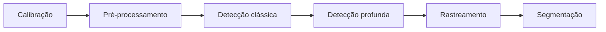
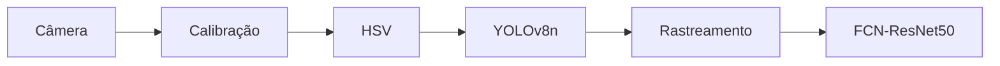

# Exercício 4 – Item B

## Relatório Integrativo — Pipeline de Percepção Visual

## 1. Pipeline completo de percepção visual

Durante a disciplina foram utilizadas diferentes técnicas de visão computacional, desde métodos clássicos até modelos de aprendizado profundo. De forma geral, elas podem ser organizadas no seguinte pipeline:

A calibração foi utilizada para obter os parâmetros da câmera e corrigir distorções. O erro médio de reprojeção obtido foi de 0,0229 px. No pré-processamento foram utilizadas técnicas como HSV e definição de regiões de interesse.

Entre as técnicas clássicas, o ORB foi usado para encontrar pontos de interesse e o Haar Cascade para detectar rostos. Depois foram utilizados modelos de aprendizado profundo, como MobileNetV2, YOLOv8n e SSD MobileNetV2. Também foi implementado o rastreamento por IoU para tentar manter o mesmo ID dos objetos entre os frames. Por fim, o FCN-ResNet50 foi utilizado para segmentação semântica, identificando classes no nível dos pixels.

## 2. Comparação das técnicas

Os principais resultados obtidos durante os exercícios foram:

| Técnica | Resultado | Complexidade |
|---|---|---|
| Calibração | Erro: 0,0229 px | Baixa/Média |
| HSV | Segmentação por cor | Baixa |
| ORB | 919,99 ms / 500 pontos | Baixa/Média |
| Haar Cascade | 656,17 ms / 1 rosto | Baixa/Média |
| MobileNet OpenCV | 18,51 ms / Top-1 60% | Média |
| MobileNet Keras | 129,24 ms / Top-1 70% | Média/Alta |
| YOLOv8n | 7,56 FPS / 132,27 ms | Alta |
| SSD MobileNetV2 | 6,60 FPS / 151,54 ms | Alta |
| Tracking IoU | 6,38 FPS / 28 ID switches | Média |
| FCN-ResNet50 | Segmentação por pixel | Alta |

Na classificação, o OpenCV DNN foi mais rápido e utilizou menos memória que o Keras, com aproximadamente 55,6 MB contra 117,4 MB. Porém, o Keras acertou 7 das 10 imagens e o OpenCV acertou 6.

Na detecção, o YOLO apresentou melhor desempenho no teste, com 7,56 FPS e modelo de 6,25 MB. O SSD ficou em 6,60 FPS e possuía 66,46 MB. No rastreamento ocorreram 28 ID switches, mostrando que a associação apenas por IoU possui limitações.

Na segmentação, o FCN conseguiu identificar classes como pessoas, carros, bicicleta e ônibus. Porém, também classificou incorretamente uma pequena região como `train`, mostrando que o modelo também pode cometer erros.

## 3. Hardware embarcado com restrição de 5 W

Neste trabalho o consumo elétrico não foi medido diretamente. Por isso, não é possível afirmar que uma técnica funciona dentro do limite de 5 W apenas com os resultados obtidos.

Técnicas mais simples, como HSV, exigem menos processamento que redes profundas. Entre os modelos testados, o OpenCV DNN apresentou menor latência e uso de memória que o Keras. O YOLO também apresentou um arquivo menor e melhor desempenho que o SSD no teste realizado.

Modelos mais complexos, como o FCN-ResNet50, poderiam precisar de otimizações em um hardware limitado, como redução da resolução, quantização ou execução em intervalos maiores. Para confirmar o funcionamento dentro de 5 W seria necessário medir o consumo diretamente no hardware.

## 4. Arquitetura para um veículo autônomo urbano

Uma possível arquitetura seria:

A calibração seria responsável pela correção da câmera. O HSV poderia auxiliar em tarefas específicas baseadas em cor. O YOLO detectaria objetos como pessoas e veículos, enquanto o rastreamento tentaria manter os IDs ao longo dos frames. O FCN complementaria essas informações através da segmentação por pixels.

Essa arquitetura combina cinco técnicas trabalhadas durante a disciplina. Porém, os 28 ID switches encontrados mostram que o rastreamento precisaria ser melhorado antes de uma aplicação real.

## 5. Lacunas para a DR4

Mesmo integrando essas técnicas, ainda existem pontos que precisam ser desenvolvidos para uma aplicação real em veículos autônomos.

A primeira lacuna é a **fusão de sensores**. Os exercícios utilizaram principalmente câmera, mas um veículo poderia combinar essas imagens com informações de LiDAR, GPS e IMU.

A segunda é o **planejamento de trajetória**. Detectar um pedestre ou veículo não é suficiente: o sistema também precisa utilizar essa informação para decidir se deve reduzir a velocidade, parar ou alterar sua trajetória.

A terceira é a **validação em condições reais**. O sistema ainda precisaria ser testado em situações como chuva, noite, sombras, mudanças de iluminação, oclusões e trânsito intenso.

## Conclusão

Os exercícios mostraram que cada técnica possui uma função diferente dentro de um sistema de percepção. Métodos como HSV são mais simples e podem ser úteis em tarefas específicas, enquanto modelos profundos conseguem fornecer informações mais completas, mas exigem mais recursos.

Também foram encontradas limitações, como os 28 ID switches no rastreamento e o erro de classificação apresentado pelo FCN. Por isso, além de verificar se uma técnica funciona, é importante analisar seus resultados e limitações.

A integração entre calibração, HSV, YOLO, rastreamento e segmentação mostra como diferentes técnicas podem trabalhar juntas. Como continuação na DR4# Exercício 4 – Item B

## Relatório Integrativo — Pipeline de Percepção Visual

## 1. Pipeline completo de percepção visual

Durante a disciplina foram utilizadas diferentes técnicas de visão computacional, desde métodos clássicos até modelos de aprendizado profundo. De forma geral, elas podem ser organizadas no seguinte pipeline:

A calibração foi utilizada para obter os parâmetros da câmera e corrigir distorções. O erro médio de reprojeção obtido foi de 0,0229 px. No pré-processamento foram utilizadas técnicas como HSV e definição de regiões de interesse.

Entre as técnicas clássicas, o ORB foi usado para encontrar pontos de interesse e o Haar Cascade para detectar rostos. No pipeline integrado foram encontrados 500 pontos ORB e uma detecção de rosto. Depois foram utilizados modelos de aprendizado profundo, como MobileNetV2, YOLOv8n e SSD MobileNetV2.

Também foi implementado o rastreamento por IoU, comparando as caixas entre frames consecutivos para tentar manter o mesmo ID dos objetos. Por fim, o FCN-ResNet50 foi utilizado para segmentação semântica, identificando classes no nível dos pixels.

## 2. Comparação das técnicas

Os principais resultados obtidos durante os exercícios foram:

| Técnica | Resultado | Complexidade |
|---|---|---|
| Calibração | Erro: 0,0229 px | Baixa/Média |
| HSV | Segmentação por cor | Baixa |
| ORB | 919,99 ms / 500 pontos | Baixa/Média |
| Haar Cascade | 656,17 ms / 1 rosto | Baixa/Média |
| MobileNet OpenCV | 18,51 ms / Top-1 60% | Média |
| MobileNet Keras | 129,24 ms / Top-1 70% | Média/Alta |
| YOLOv8n | 7,56 FPS / 132,27 ms | Alta |
| SSD MobileNetV2 | 6,60 FPS / 151,54 ms | Alta |
| Tracking IoU | 6,38 FPS / 28 ID switches | Média |
| FCN-ResNet50 | Segmentação por pixel | Alta |

Na classificação, o OpenCV DNN foi mais rápido e utilizou menos memória que o Keras, com aproximadamente 55,6 MB contra 117,4 MB. Porém, o Keras acertou 7 das 10 imagens e o OpenCV acertou 6. Esses resultados são referentes apenas ao conjunto de imagens utilizado no exercício.

Na detecção, o YOLO apresentou 7,56 FPS e modelo de 6,25 MB, enquanto o SSD ficou em 6,60 FPS e possuía 66,46 MB. Assim, no teste realizado, o YOLO apresentou uma combinação melhor entre velocidade e tamanho.

No rastreamento ocorreram 28 ID switches. Isso mostra uma limitação da associação somente por IoU, pois quando uma detecção é perdida ou muda muito de posição, o algoritmo pode criar um novo ID para o mesmo objeto.

Na segmentação, o FCN conseguiu identificar classes como pessoas, carros, bicicleta e ônibus. Porém, também classificou incorretamente uma pequena região como `train`, mostrando que mesmo um modelo de aprendizado profundo pode apresentar erros.

## 3. Hardware embarcado com restrição de 5 W

Durante os exercícios não foi realizado um teste de consumo elétrico em hardware embarcado. Por isso, não é possível afirmar quais técnicas utilizadas funcionariam dentro de uma restrição de 5 W.

Para fazer a análise pedida no exercício, foram considerados apenas os resultados que realmente foram medidos, como latência, memória, FPS e tamanho dos modelos. Na comparação da MobileNetV2, por exemplo, o OpenCV DNN apresentou menor latência e menor uso de memória que o Keras. Na detecção de objetos, o YOLOv8n também apresentou maior FPS e um modelo menor que o SSD MobileNetV2 no teste realizado.

As técnicas também possuem níveis diferentes de complexidade. O HSV realiza operações mais simples sobre a imagem, enquanto modelos como YOLO e FCN utilizam redes de aprendizado profundo e exigem mais processamento.

Esses resultados ajudam a identificar quais alternativas foram mais leves nos testes realizados, mas não são suficientes para determinar o consumo em watts. Para verificar se alguma dessas técnicas realmente atende ao limite de 5 W, seria necessário executá-la em um hardware embarcado e medir diretamente seu consumo elétrico.

## 4. Arquitetura para um veículo autônomo urbano

Uma possível arquitetura seria:

A calibração seria responsável por corrigir a imagem da câmera antes das outras etapas. O HSV poderia auxiliar em tarefas específicas baseadas em cor, mas não seria utilizado sozinho, já que depende bastante das condições da imagem.

O YOLO seria responsável pela detecção dos objetos, como pessoas e veículos. Depois, o rastreamento tentaria manter a identificação desses objetos entre os frames e permitiria observar suas trajetórias. O FCN complementaria essas informações através da segmentação por pixels, ajudando a entender melhor quais regiões pertencem a determinadas classes.

Essa arquitetura combina cinco técnicas trabalhadas durante a disciplina. Mesmo assim, os resultados mostram pontos que ainda precisam ser melhorados. Os 28 ID switches, por exemplo, indicam que o rastreamento simples por IoU ainda não seria suficiente para uma aplicação real que precise manter a identificação dos objetos com maior estabilidade.

## 5. Lacunas para a DR4

Mesmo integrando essas técnicas, ainda existem pontos que precisam ser desenvolvidos para uma aplicação real em veículos autônomos.

A primeira lacuna é a **fusão de sensores**. Os exercícios utilizaram principalmente câmera, mas um veículo autônomo poderia combinar as imagens com informações de LiDAR, GPS e IMU. Isso permitiria utilizar diferentes fontes de informação para compreender melhor o ambiente e o movimento do próprio veículo.

A segunda lacuna é o **planejamento de trajetória**. Detectar um pedestre ou veículo não é suficiente. Depois da percepção, o sistema precisa utilizar essas informações para decidir se deve reduzir a velocidade, parar ou alterar sua trajetória.

A terceira lacuna é a **validação em condições reais**. O sistema ainda precisaria ser testado em situações como chuva, noite, sombras, mudanças de iluminação, oclusões e trânsito intenso. Essas condições podem alterar bastante o resultado das técnicas de visão computacional.

## Conclusão

Os exercícios mostraram que cada técnica possui uma função diferente dentro de um sistema de percepção. Métodos como HSV são mais simples e podem ser úteis em tarefas específicas, enquanto modelos profundos conseguem fornecer informações mais completas, mas exigem mais recursos.

Também foram encontradas limitações durante os testes, como os 28 ID switches no rastreamento e a classificação incorreta apresentada pelo FCN. Isso mostra que não basta verificar se o código executa corretamente, sendo importante também analisar a qualidade dos resultados.

A integração entre calibração, HSV, YOLO, rastreamento e segmentação mostra como diferentes técnicas podem trabalhar juntas em um sistema de percepção. Como continuação na DR4, ainda seria necessário estudar a fusão de sensores, o planejamento de trajetória e realizar testes em condições reais antes de pensar em uma aplicação em um veículo autônomo., ainda seria necessário estudar a fusão de sensores, o planejamento de trajetória e testes em condições reais.