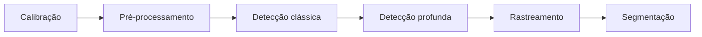

# Exercício 4 – Item B

## Relatório Integrativo — Pipeline de Percepção Visual

## 1. Pipeline completo

Durante a disciplina foram utilizadas técnicas clássicas e modelos de aprendizado profundo. De forma geral, elas podem ser organizadas no seguinte pipeline:

A calibração permite obter os parâmetros da câmera e corrigir distorções. Depois, o pré-processamento prepara a imagem para as outras etapas. Foram utilizados HSV para segmentação por cor, ORB para encontrar pontos de interesse e Haar Cascade para detecção facial. Também foram utilizados MobileNetV2, YOLOv8n e SSD com aprendizado profundo. Por fim, o rastreamento por IoU tentou manter os IDs dos objetos e o FCN-ResNet50 realizou a segmentação por pixels.

## 2. Comparação das técnicas

A tabela apresenta os principais resultados obtidos nos testes:

| Técnica | Resultado | Complexidade |
|---|---|---|
| Calibração | Erro de 0,0229 px | Baixa/Média |
| HSV | Segmentação por cor | Baixa |
| ORB | 919,99 ms / 500 pontos | Baixa/Média |
| Haar Cascade | 656,17 ms / 1 rosto | Baixa/Média |
| MobileNet OpenCV | 18,51 ms / Top-1 60% | Média |
| MobileNet Keras | 129,24 ms / Top-1 70% | Média/Alta |
| YOLOv8n | 7,56 FPS / 132,27 ms | Alta |
| SSD MobileNetV2 | 6,60 FPS / 151,54 ms | Alta |
| Tracking IoU | 6,38 FPS / 28 ID switches | Média |
| FCN-ResNet50 | Segmentação por pixel | Alta |

Nos testes, o OpenCV DNN foi mais rápido e utilizou menos memória que o Keras, apesar do Keras ter acertado uma imagem a mais. Entre YOLO e SSD, o YOLO apresentou maior FPS, menor latência e também um modelo menor. Já no rastreamento, os 28 ID switches mostraram que a associação apenas por IoU possui limitações.

## 3. Hardware embarcado com limite de 5 W

O consumo elétrico não foi medido diretamente, então não é possível afirmar que uma técnica funciona dentro de 5 W apenas com esses testes. Mesmo assim, técnicas como HSV são mais simples, enquanto redes profundas exigem mais processamento. Em um hardware limitado, poderiam ser usadas otimizações como redução da resolução, quantização ou execução dos modelos em intervalos maiores.

## 4. Arquitetura para um veículo autônomo

Uma possível arquitetura seria:

**Câmera → Calibração → HSV → YOLOv8n → Rastreamento → FCN-ResNet50**

A calibração corrigiria a imagem, o HSV poderia auxiliar na identificação de regiões por cor, o YOLO detectaria os objetos, o rastreamento acompanharia esses objetos entre os frames e o FCN forneceria informações no nível dos pixels. Assim, as técnicas se complementariam para formar uma percepção mais completa do ambiente.

## 5. Lacunas para a DR4

Ainda existem pontos que precisam ser desenvolvidos para uma aplicação em veículos autônomos:

1. **Fusão de sensores:** combinar câmera com LiDAR, GPS e IMU.
2. **Planejamento de trajetória:** utilizar a percepção para decidir como o veículo deve se movimentar.
3. **Validação em situações reais:** testar o sistema em chuva, noite, mudanças de iluminação, oclusões e trânsito intenso.

## Conclusão

Os testes mostraram que cada técnica possui vantagens e limitações. Métodos clássicos podem ser úteis em tarefas mais simples, enquanto os modelos profundos conseguem extrair informações mais completas, mas exigem mais recursos. Os resultados também mostraram limitações, como os 28 ID switches no rastreamento e erros de classificação na segmentação. Por isso, a escolha das técnicas depende da aplicação, do hardware disponível e das condições em que o sistema será utilizado.